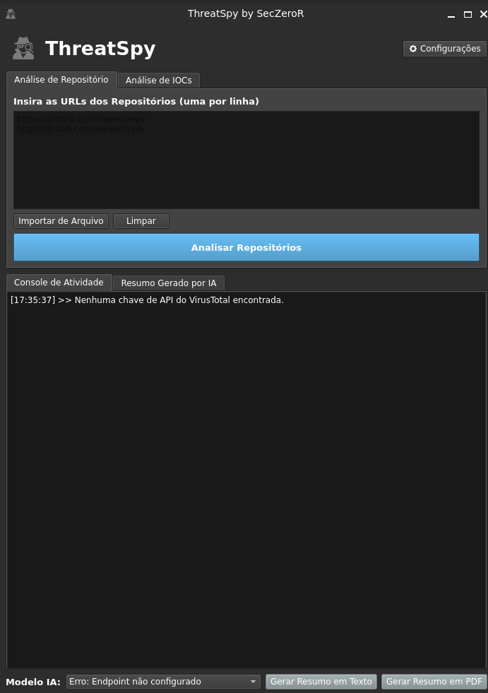

<h1 align="center">ThreatSpy</h1>

<div align="center">


</div>

<div align="center">
</div>

<p align="center">
  
</p>

Uma ferramenta de análise e inteligência de ameaças (Threat Intelligence) que automatiza a consulta de IPs, URLs e arquivos em múltiplas fontes, gera relatórios profissionais e cria resumos com IA local.

## Requisitos

- **Python 3.8+** instalado no sistema. Baixe em: https://www.python.org/downloads/
- **Ollama** instalado (opcional) para usar os resumos por IA local. Baixe em: https://ollama.com/
- **Chaves de API** dos serviços que você pretende usar:
  - VirusTotal (essencial)
  - AbuseIPDB
  - URLHaus
  - Shodan
  - MalwareBazaar
- **Fonts DejaVu** (opcional, recomendadas para PDF): `DejaVuSans.ttf` e `DejaVuSans-Bold.ttf` na pasta do projeto.

## Sobre o Projeto

O ThreatSpy é uma ferramenta de código aberto para análise de indicadores de comprometimento (IPs, URLs e hashes de arquivos). Ele automatiza consultas em múltiplas APIs (VirusTotal, AbuseIPDB, URLHaus, Shodan, MalwareBazaar) para enriquecer dados e gerar relatórios de forma rápida.

O projeto começou como um script simples para um colega e evoluiu para esta suíte de análise completa, com interface gráfica moderna e IA local para resumos.

## Funcionalidades Principais

- **Análise Multi-Alvo**: Verifique a reputação de IPs, URLs e arquivos locais. A ferramenta consulta o VirusTotal e o MalwareBazaar para identificar ameaças conhecidas em arquivos.
- **Análise Massivamente Paralela**: O motor de análise foi reescrito para usar processamento paralelo, consultando dezenas de indicadores simultaneamente e reduzindo drasticamente o tempo de análise.
- **Interface Gráfica Moderna**: Uma interface intuitiva construída com PySide6, com tema escuro e uma janela de configurações organizada em abas.
- **Relatórios Profissionais**: Exporte os resultados para arquivos Excel (.xlsx) formatados ou para um resumo em PDF, que agora inclui um rodapé profissional com data, hora e número de página.
- **Resumos com IA Contextual**: A integração com Ollama está mais inteligente. A IA agora entende o status da análise (por exemplo: "Não Encontrado", "Limite de API Atingido") e fornece recomendações específicas para cada cenário.
- **Gestão Segura de Chaves**: Suas chaves de API são armazenadas de forma segura no cofre de credenciais nativo do sistema operacional usando a biblioteca `keyring`.
- **Confiável e resiliente**
  - Verificação de arquivos em uso: avisa se um arquivo a ser analisado, ou o relatório de saída, está bloqueado por outro programa.
  - Retentativas inteligentes: tenta novamente em erros 5xx ou bloqueios temporários 403 Forbidden.
  - Logging centralizado: eventos e erros salvos em `threatspy.log` para facilitar a depuração.

## Screenshot da Ferramenta

<p align="center">
  
</p>

## Download e Instalação

### Para Usuários (Windows)

1. Acesse a página de **[Releases](https://github.com/DevGreick/ThreatSpy/releases)**.
2. Baixe o arquivo `.zip` ou `.exe` da versão mais recente.
3. Se baixou o `.zip`, descompacte o arquivo em uma pasta.
4. Execute o arquivo `ThreatSpy.exe`.
5. Na primeira vez que usar, vá em **Configurações** para adicionar suas chaves de API.

### Para Usuários (macOS)

1. Acesse a página de **[Releases](https://github.com/DevGreick/ThreatSpy/releases)**.
2. Baixe o arquivo `.zip` ou `.app` da versão mais recente.
3. Descompacte e execute o arquivo `ThreatSpy.app`.
4. Nota: o macOS pode exibir um aviso de segurança. Se isso ocorrer, clique com o botão direito no arquivo, selecione "Abrir" e confirme na caixa de diálogo para permitir a execução.

### Para Usuários (Linux)

1. Acesse a página de **[Releases](https://github.com/DevGreick/ThreatSpy/releases)**.
2. Baixe o arquivo `.zip` da versão mais recente.
3. Descompacte o arquivo e torne-o executável:
   ```bash
   chmod +x ThreatSpy
   ```
4. Execute o programa:
   ```bash
   ./ThreatSpy
   ```
5. Na primeira vez que usar, vá em **Configurações** para adicionar suas chaves de API.

### Para Desenvolvedores (a partir do Código-Fonte)

1. **Pré-requisitos:** Garanta que você tenha **Python 3.8+** e **Git** instalados. Para a função de IA, o **Ollama** (https://ollama.com) deve estar instalado e rodando localmente.
   - Cheque se o Ollama está ok com:
     ```bash
     ollama list
     ```
   - Se quiser testar um modelo leve:
     ```bash
     ollama run llama3
     ```

2. **Clone o repositório:**
   ```bash
   git clone https://github.com/DevGreick/ThreatSpy
   cd ThreatSpy
   ```

3. **Instale as dependências:**
   > É altamente recomendado criar e ativar um ambiente virtual primeiro
   ```bash
   pip install -r requirements.txt
   ```

4. **Execute o programa:**
   ```bash
   python main_gui.py
   ```

## Configuração
Após instalar e executar o ThreatSpy pela primeira vez, a etapa mais importante é configurar as chaves de API.

Clique no botão **Configurações** no canto superior direito para abrir a janela de gerenciamento de chaves.

####  Chave Principal (Essencial)
-   **VirusTotal:** Esta chave é essencial para a funcionalidade principal do programa (análise de IPs, URLs e arquivos). O ThreatSpy irá solicitar que você a configure no primeiro uso.

####  Chaves Opcionais (Recomendadas)
As chaves abaixo não são obrigatórias, mas enriquecem enormemente a análise, adicionando mais contexto e fontes de dados aos seus relatórios.
-   **AbuseIPDB:** Fornece um score de abuso e a localização de IPs.
-   **Shodan:** Busca por portas abertas, vulnerabilidades (CVEs) e outros detalhes de infraestrutura de IPs.
-   **URLHaus:** Verifica se uma URL está listada em sua base de dados de URLs maliciosas.
-   **MalwareBazaar:** Verifica o hash de arquivos contra sua base de dados de amostras de malware.

#### IA Local (Opcional)
-   **Ollama:** Para usar a funcionalidade de resumo com Inteligência Artificial, você precisa ter o [Ollama](https://ollama.com/) instalado e em execução no seu computador. O endpoint padrão (`http://localhost:11434/api/generate`) já vem configurado.

> Se uma chave opcional não for fornecida, o programa continuará funcionando normalmente, e as colunas correspondentes no relatório simplesmente não serão preenchidas.

## Como Usar

A ferramenta possui dois fluxos de análise principais.

| Tipo de análise            | Como fazer |
|----------------------------|------------|
| Analisar IPs e URLs        | Cole os indicadores na caixa de texto, um por linha, ou use o botão "Importar Alvos de Arquivo". Em seguida, clique no botão verde "Analisar Alvos". |
| Analisar arquivos locais   | Clique em "Verificar Reputação de Arquivos" e selecione um ou mais arquivos do seu computador. |

Após qualquer análise, a aba **Resumo Gerado por IA** pode ser usada para gerar relatórios em texto ou PDF.


## Contribuição

Este é um projeto de código aberto e contribuições são muito bem-vindas. Se você encontrar um bug, tiver uma sugestão de melhoria ou quiser adicionar uma nova funcionalidade, abra uma Issue ou um Pull Request.

## Licença

Este projeto é distribuído sob a Licença MIT. Veja o arquivo `LICENSE` para mais detalhes.
