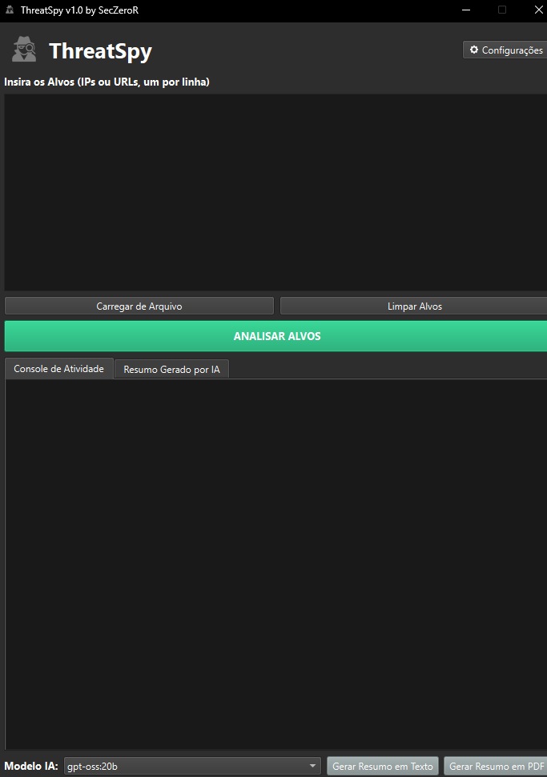

# Vtotalscan v1.0

<p align="center">
  
</p>

Uma ferramenta de análise e inteligência de ameaças (Threat Intelligence) que automatiza a consulta de IPs e URLs em múltiplas fontes, gera relatórios profissionais e cria resumos com IA local.

---

## 📜 Sobre o Projeto

O Vtotalscan é uma ferramenta de código aberto para análise de indicadores de comprometimento (IPs e URLs). Ele automatiza consultas em múltiplas APIs (VirusTotal, AbuseIPDB, URLHaus, Shodan) para enriquecer dados e gerar relatórios de forma rápida.

O projeto começou como um script simples para um colega e evoluiu para esta suíte de análise completa, com interface gráfica moderna e IA local para resumos.

## ✨ Funcionalidades Principais

* **Análise Multi-API:** Enriqueça seus dados consultando indicadores simultaneamente no **VirusTotal, AbuseIPDB, URLHaus e Shodan**.
* **Interface Gráfica Moderna:** Uma interface intuitiva e agradável construída com **PySide6**, com tema escuro.
* **Relatórios Profissionais:** Exporte os resultados consolidados para arquivos **Excel (.xlsx)** formatados (com cores e links) ou para um resumo em **PDF**.
* **Resumos com IA Local:** Integração com **Ollama** para gerar resumos técnicos inteligentes das análises, com detecção automática dos seus modelos instalados. Seus dados nunca saem da sua máquina.
* **Gestão Segura de Chaves:** Suas chaves de API são armazenadas de forma segura no cofre de credenciais nativo do sistema operacional (**Windows Credential Manager, macOS Keychain, etc.**) usando a biblioteca `keyring`.
* **Processamento Eficiente:** As análises rodam em uma thread separada para não travar a interface, com barra de progresso e opção de cancelamento. O cliente de API implementa um **rate limit inteligente**, respeitando os pedidos de espera das APIs (`Retry-After`).

## 🖥️ Screenshot da Ferramenta




## ⚙️ Pré-requisitos

Antes de começar, garanta que você tem os seguintes pré-requisitos instalados:

1.  **Python 3.8 ou superior**.
2.  As bibliotecas Python listadas no arquivo `requirements.txt`.
3.  **Ollama (Opcional):** Necessário apenas se você quiser usar a funcionalidade de resumo com IA. Disponível em [ollama.com](https://ollama.com).
4.  **Fontes DejaVu (Opcional):** Recomendado para a correta geração dos PDFs. Baixe os arquivos `DejaVuSans.ttf` e `DejaVuSans-Bold.ttf` e coloque-os na mesma pasta do projeto.
5.  **Chaves de API:** Você precisará de chaves para os serviços que deseja usar:
    * [VirusTotal](https://www.virustotal.com/gui/join-us)
    * [AbuseIPDB](https://www.abuseipdb.com/register)
    * [URLHaus](https://urlhaus.abuse.ch/api/)
    * [Shodan](https://account.shodan.io/register)

## Instalação e Configuração

1.  **Clone o repositório:**
    ```bash
    git clone [https://github.com/DevGreick/Vtotalscan.git](https://github.com/DevGreick/Vtotalscan.git)
    cd Vtotalscan
    ```

2.  **Instale as dependências:**
    (É altamente recomendado criar e ativar um ambiente virtual primeiro)
    ```bash
    pip install -r requirements.txt
    ```

3.  **Execute o programa:**
    ```bash
    python main_gui.py
    ```

4.  **Primeira Configuração:**
    * Ao executar pela primeira vez, clique em **Configurações**.
    * Insira as chaves de API que você obteve. Os links na janela de configurações te ajudarão a encontrar as páginas de registro de cada serviço.
    * Salve as configurações. Suas chaves serão guardadas com segurança no seu sistema.

## 📋 Como Usar

1.  **Insira os Alvos:** Cole os IPs ou URLs na área de texto (um por linha) ou carregue de um arquivo `.txt` usando o botão "Carregar de Arquivo".
2.  **Inicie a Análise:** Clique em "ANALISAR ALVOS" e escolha onde salvar o relatório Excel.
3.  **Acompanhe o Progresso:** Veja o status da análise em tempo real no "Console de Atividade".
4.  **Gere o Resumo com IA:** Após a análise, vá para a aba "Resumo Gerado por IA", selecione um modelo do Ollama e clique em "Gerar Resumo em PDF" ou "Gerar Resumo em Texto".

## 🤝 Contribuição

Este é um projeto de código aberto e contribuições são muito bem-vindas! Se você encontrar um bug, tiver uma sugestão de melhoria ou quiser adicionar uma nova funcionalidade, sinta-se à vontade para abrir uma **Issue** ou um **Pull Request**.

## 📄 Licença

Este projeto é distribuído sob a Licença MIT. Veja o arquivo `LICENSE` para mais detalhes.
